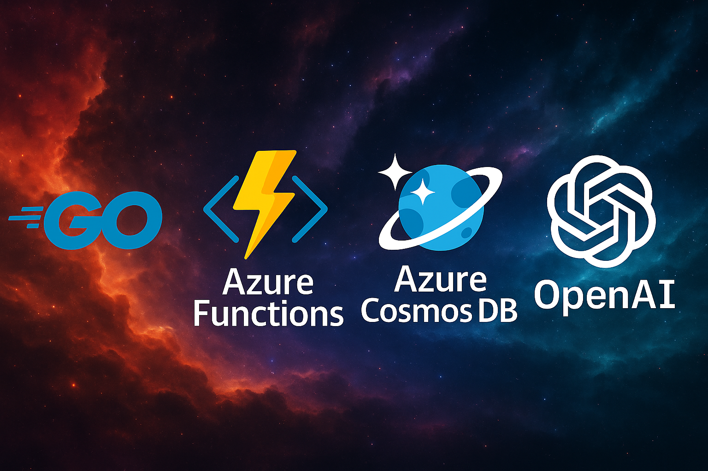
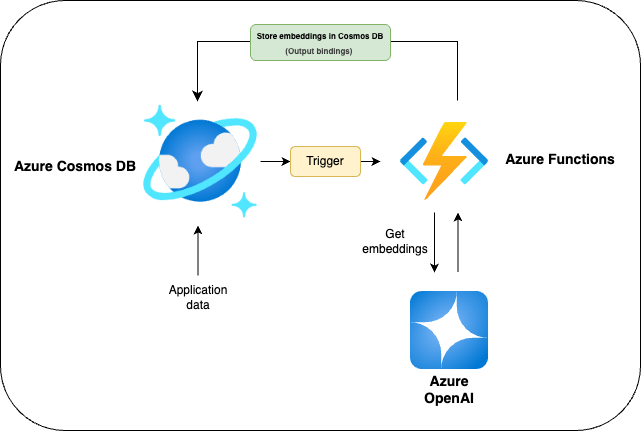

# Building Event-Driven Go applications with Azure Cosmos DB and Azure Functions

Go is well-suited for serverless applications due to its simple deployment, fast startup times, and low memory usage. This GitHub repository provides examples of how to build Azure Functions with Go that make use of these Azure Cosmos DB integrations.

1. [Get started easily](getting_started_guide): A function that gets triggered by changes in a Cosmos DB container and simply logs the raw Azure Functions event payload and the Cosmos DB document. You can run the function and also test it with Cosmos DB locally, thanks to the [Cosmos DB emulator](https://learn.microsoft.com/en-us/azure/cosmos-db/emulator) and [Azure Functions Core Tools](https://learn.microsoft.com/en-us/azure/azure-functions/functions-run-local?tabs=linux%2Cisolated-process%2Cnode-v4%2Cpython-v2%2Chttp-trigger%2Ccontainer-apps&pivots=programming-language-csharp).

2. [Embeddings generator function](embeddings_generator): Creates vector embeddings for the documents in the Cosmos DB container using [Azure OpenAI](https://learn.microsoft.com/en-us/azure/ai-services/openai/overview) and stores the embeddings back in the container. This is useful for building applications that require semantic search or other generative AI applications.

